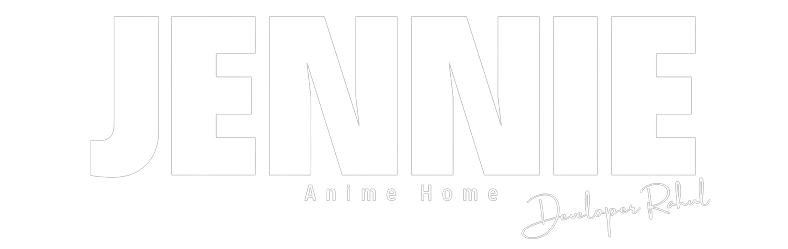

<div align="center">




[](https://github.com/Cosmicoppai/LiSA/network)
[](https://github.com/Cosmicoppai/LiSA/stargazers)
[](https://github.com/Cosmicoppai/LiSA/issues)
[](./LICENSE)


</div>

# Jennie - Anime player

> A Desktop application, for streaming and downloading your favourite anime.

## CONTENTS OF THE FILE

-   [Features](#-features)
-   [Dependencies](#dependencies)
-   [Download](#-download)
-   [Installation](#-installation)
-   [Demo](#-demo)
-   [Future Plans](#future-plans)
-   [FAQ](#-faq)
-   Appendix
    -   [Supported Webistes](#%EF%B8%8F-supported-websites)
    -   [Supported External Video Player](#-supported-external-players)
    -   [Filters](#filters)
-   [Contributing](#-contributing)
-   [Support](#-support)
-   [License](#-license)
-   [Disclaimer](#disclaimer)

## 🚀 Features

-   A User Friendly Interface
-   Download anime from [supported websites](#-supported-websites) in multiple resolutions and languages
-   Batch Download
-   Stream anime on the inbuilt player and your favourite [external video player](#-supported-external-players)
-   Explore anime based on different [filters](#filters)
-   Download Manager
-   Library to view pre-downloaded episodes and active downloads
-   Recommendation System

<br>

## Dependencies

-   [ffmpeg](https://ffmpeg.org/download.html)

<br>


## 📖 Installation

### Building From Source

-   Clone the project using

    ```cli
    git clone https://github.com/Cosmicoppai/LiSA.git
    ```

#### Prerequisites

-   Make sure python 3.10 and node 18 are installed.

#### Installing

1. Create and activate the virtual environment

    ```cli
    python -m venv ./env
    env/Script/activate
    ```

2. Install the dependencies using the `requirements.txt` and `build_requirements.txt` files.

    ```cli
    pip install -r ./requirements.txt
    pip install -r ./build_requirements.txt
    ```

3. Create `.env` & paste the following content

    ```dotenv
    REACT_APP_SERVER_URL=http://localhost:6969
    REACT_APP_SOCKET_URL=ws://localhost:9000
    ```

4. Install Node modules

    ```
    npm install
    ```

5. Add `ffmpeg` executable to `root folder` or in `PATH` Var.

6. run package using

    ```
    npm start
    ```
    
7. Build package using

    ```cli
    npm run build:package:windows
    ```

Note:

> Make sure to allow app to run as admin and allow incomming port forwarding on (`6969`, `9000`).

<br>

### Environment Tested on

-   Tested on Windows 8, 10 & 11.

<br>

## 😁 Demo


<br>

## DISCLAIMER

This software has been developed just to improve users experience while streaming and downloading anime. Please support original content creators!
